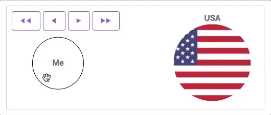

[](https://badge.fury.io/js/identityfusion)

# Description

The `identityfusion` module turns an HTML input into an interactive
widget that administers the [Dynamic Identity Fusion Index (DIFI)](http://www2.uned.es/pspp/measures/difi/index.htm) 
[1], which assesses the degree to which the user's own identity
fuses with a group identity. The widget consists of a circle labeled
"Me" which can be dragged or moved using buttons to overlap a circle
which represents the group.



Two values are recorded:

1. Distance
2. Overlap

[1] Jimenez, J., Gomez, A., Buhrmester, M. D., Vázquez, A., 
Whitehouse, H., & Swann, W. B. (2016). The dynamic identity fusion 
index: A new continuous measure of identity fusion for web-based 
questionnaires. *Social Science Computer Review*, 34(2), 215-228.

# Usage

To use the widget, create an HTML input with a name:

```
<input name="DIFI" id="DIFI" />
```

Then include the library and create a new DIFIInput instance:

```
<script src="identityfusion.js"></script>
<script>
  var el = document.getElementById('DIFI');
  new identityfusion.DIFIInput(el, {
    groupLabel: 'USA'
  });
</script>
```

Instantiating the DIFIInput will replace the original input
with two hidden inputs named `DIFI_distance` and `DIFI_overlap`
(with the original name as the prefix).

See `dist/demo.html` for an example.

# Options

Several options can be specified in the second parameter
when constructing a DIFIInput:

* `meLabel`: The label for the circle representing the user. (Default: `Me`)
* `groupLabel`: The label for the circle representing the group. (Default: `Group`)
* `groupImage`: URL for an image to be shown as the background of the group circle. (Default: none)

# Disclaimer

This project is sponsored by the Defense Advanced Research Projects Agency through the NGS2 program. The contents of this directory does not necessarily reflect the position or the policy of the Government and no official endorsement should be inferred.
